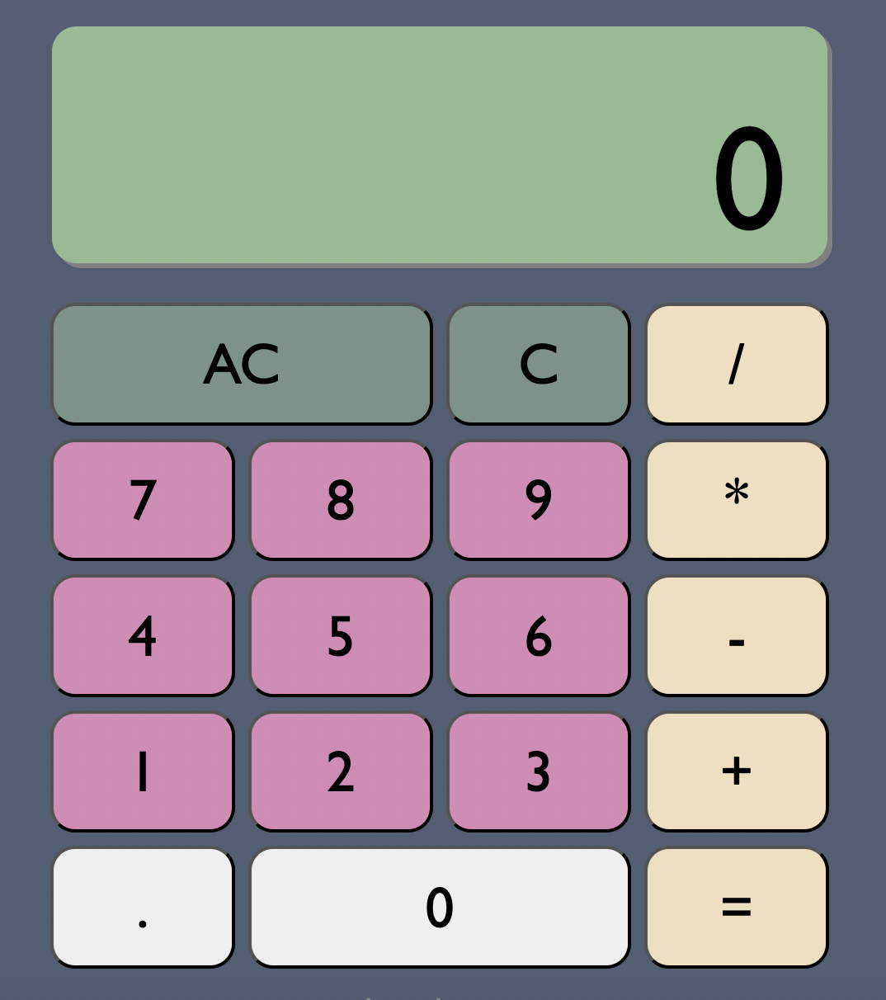
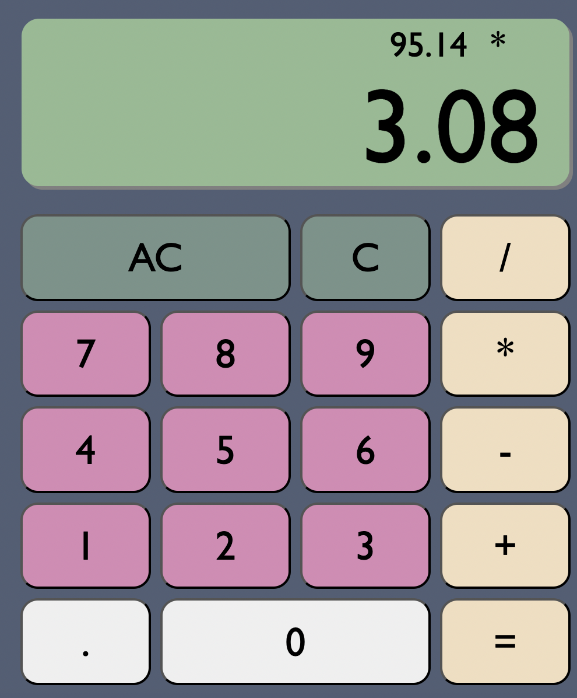
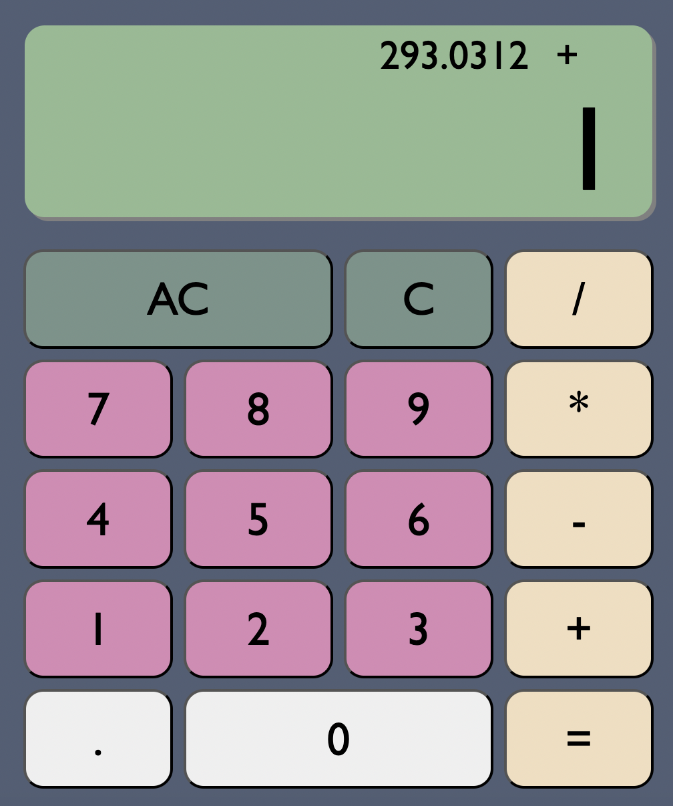
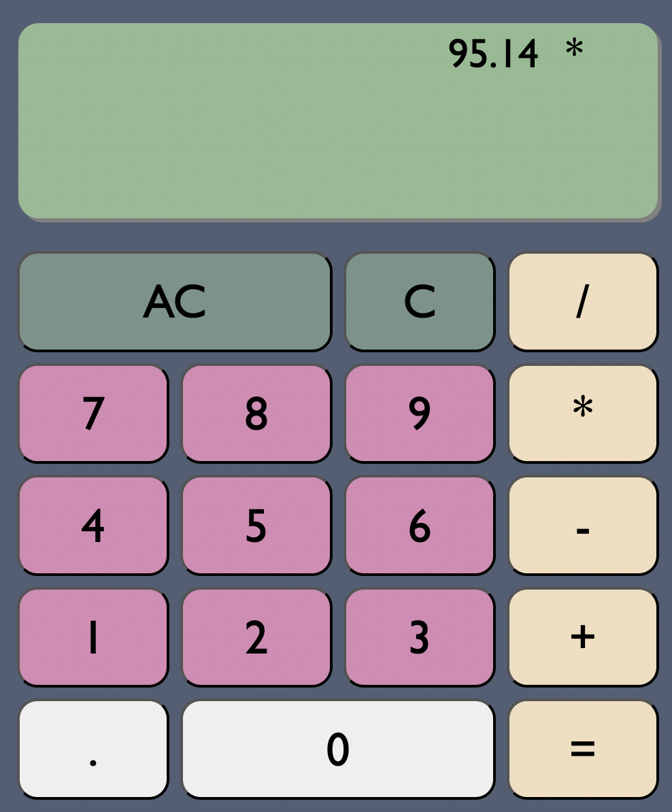
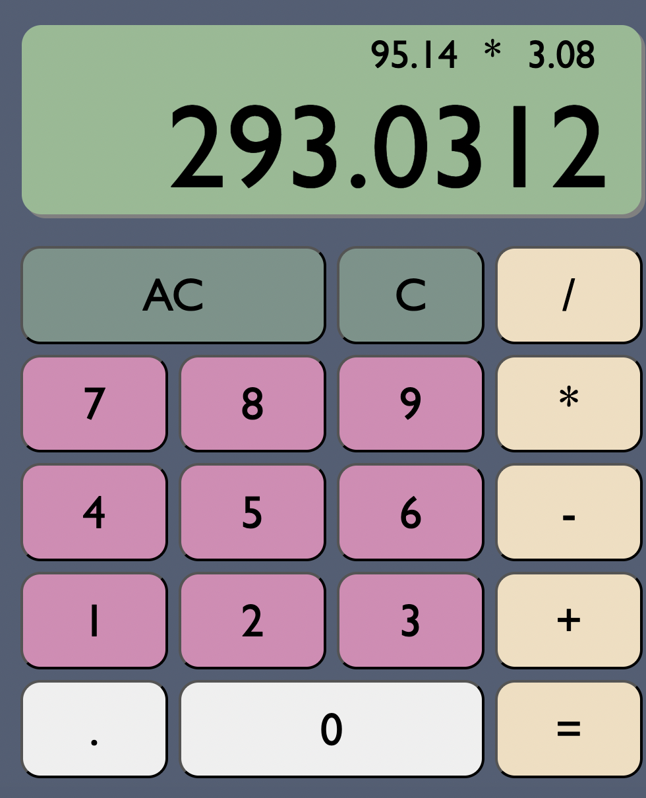
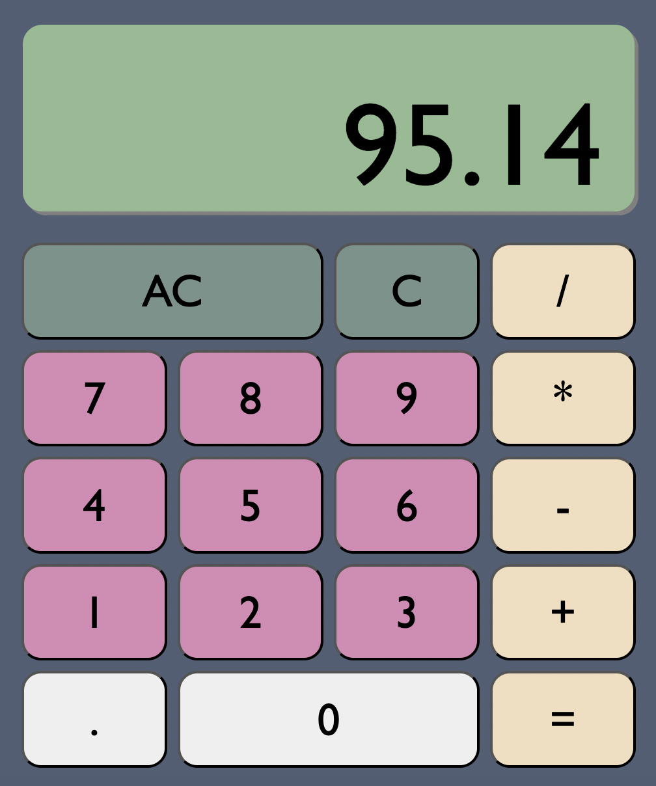
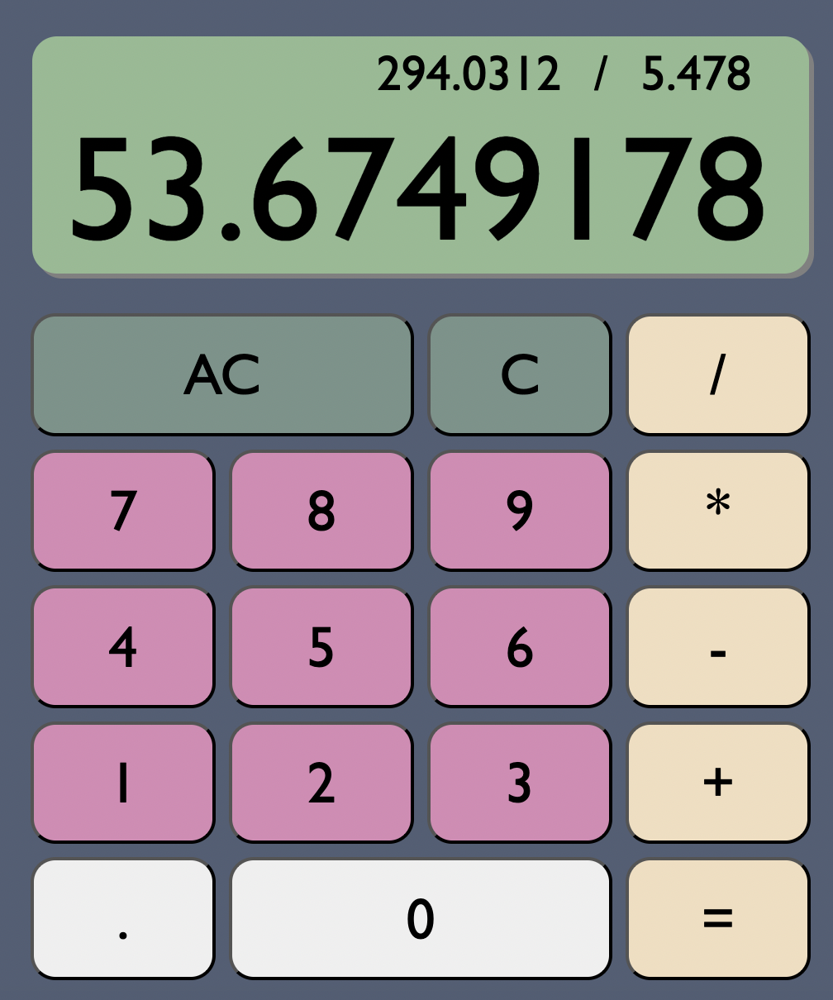
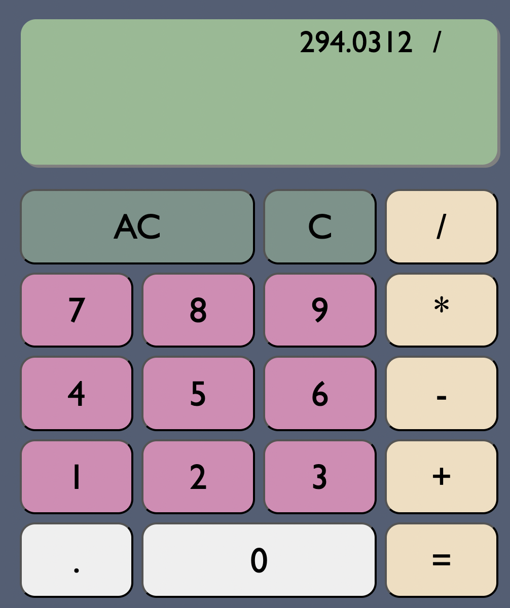
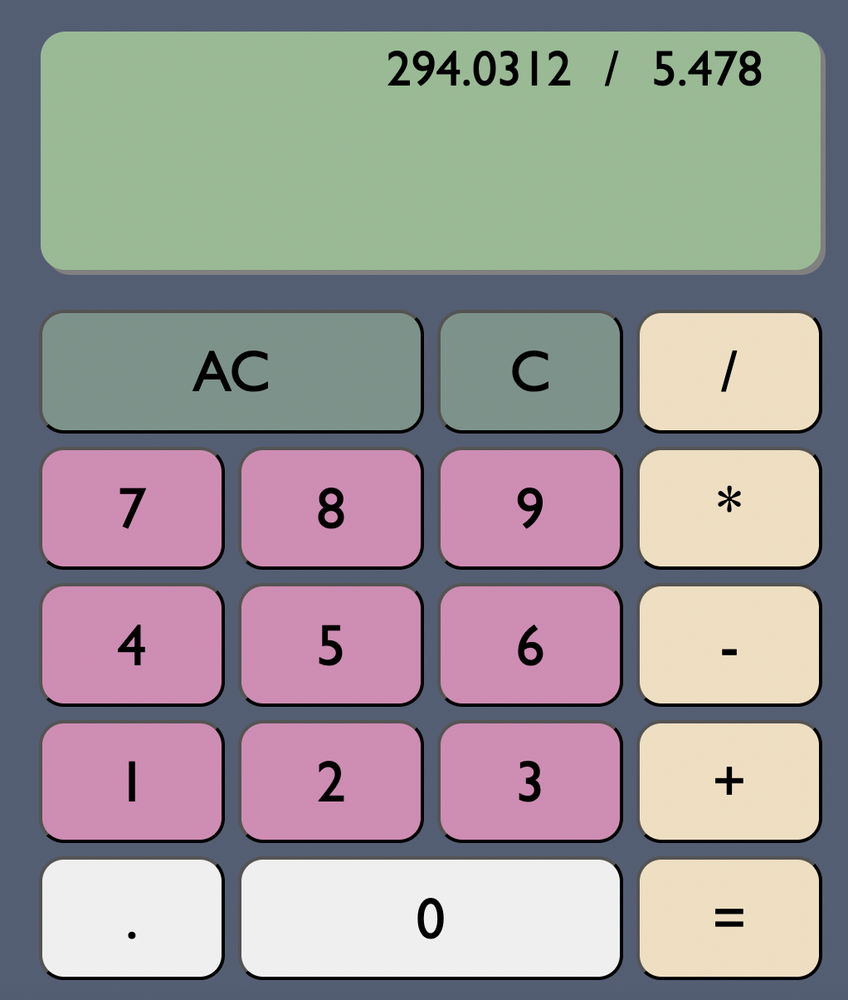

# calculator

A simple calculator made with Javascript, HTML, &amp; CSS.

## Table of contents

- [Overview](#overview)
  - [Built with](#built-with)
- [Usage](#usage)
  - [Display](#display)
  - [Decimal point](#decimal-point)
  - [Limit of digit display](#limit-of-digit-display)
  - [Clear functions](#clear-functions)
- [Refactors](#refactors)
- [Issues](#issues)
- [Acknowledgments](#acknowledgments)

## Overview

This simple calculator's functions include addition, subtraction, multiplication, and division. It allows users to enter numbers with up to a single decimal point, and has a button to clear the main display and an All Clear button to clear out all displays.

#### Built with

- JavaScript
- HTML
- CSS
- jQuery

## Usage

#### Display

There are two displays: one larger main display for digits entered, and a smaller top display for showing digits entered before the operator and results of an operation.

 

When a new operator (+, -, \*, /) is clicked, the results of the previous operation is displayed on top with the first operand as well as the operator, and the main display is cleared for entered a new number.

When the equal (=) button is clicked, the top display shows the full operation with both operands and the operator used, and the result is displayed on the main display.

#### Decimal Point

Users may enter up to a single decimal point in a number. If the decimal point is entered at the beginning of a number, a zero (0) will appear before the decimal point.

#### Limit of Digit Display

When entered a number, the display limits the number of places in order to fit the main display screen.

#### Clear functions

The Clear ("C") button will clear the main display for a new entry, keeping the top display intact.

 

 
The All Clear ("AC") button will reset and clear all displays.

## Refactors

This calculator was initially built with vanilla JavaScript, HTML, and CSS, and was later refactored to use the jQuery library for its main functionalities.

## Issues

- [ ] The clear button clears the main display and keeps the previous operation displayed on top, but this previous operation can no longer be worked with. It is simply a display and is erased from future functioning.

## Acknowledgments

Author: [Emily Knott](www.emilyknott.com)

Initially built for [The Odin Project's Foundations Course: Final Project](https://www.theodinproject.com/lessons/foundations-calculator).

It has been refactored to meet the project specifications of freeCodeCamp's [Front End Development Libraries Course](https://www.freecodecamp.org/learn/front-end-development-libraries/).
